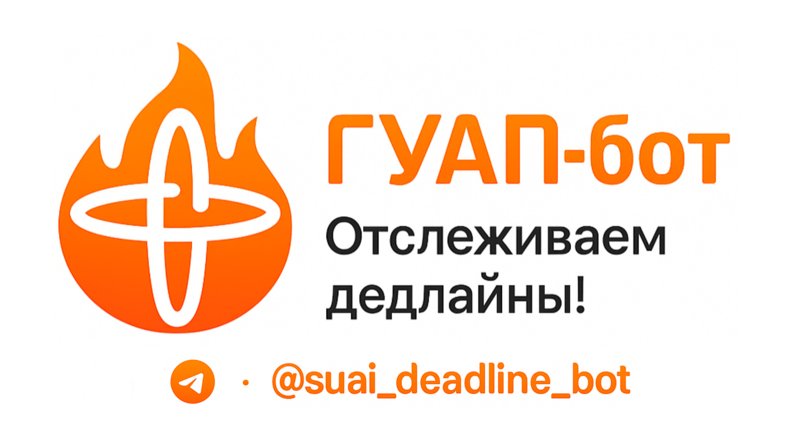

<h1 align="center">
  
</h1>

<h1 align="center">
    
  SUAI Deadline Bot 🤖🔥

  
  
  
  [](LICENSE)
  
</h1>

Телеграм-бот для студентов ГУАП, который автоматически отслеживает дедлайны в личном кабинете и присылает уведомления. Проект выполнен в рамках <b><i>учебной практики</i></b>🎓.

## ✨ Основные возможности

*   **🔍 Автоматический парсинг ЛК:** Бот самостоятельно заходит в личный кабинет `pro.guap.ru` и собирает актуальные дедлайны.
*   **🔔 Гибкие уведомления:**
    *   **Ежедневные:** Напоминания за 1, 3 или 7 дней до сдачи.
    *   **Частые:** Возможность получать дедлайны каждые N часов.
*   **🎨 Персонализация:** Пользователь может включать/выключать уведомления и настраивать их частоту.
*   **🙋🏻‍♂️ Кастомные дедлайны:** Возможность добавлять и удалять собственные (личные дедлайны), которые не связаны с ЛК.
*   **🔐 Безопасность:** Все учетные данные (логин, пароль) хранятся в базе данных в зашифрованном виде.
*   **📲 Удобный интерфейс:** Управление через команды и интерактивные inline-кнопки.

## 🛠 Технологический стек

*   **Язык:** [Python 3.12.5](https://www.python.org/downloads/release/python-3125)
*   **Асинхронный фреймворк:** [asyncio](https://docs.python.org/3/library/asyncio.html)
*   **Telegram Bot API:** [aiogram 3.x](https://docs.aiogram.dev/en/v3.22.0)
*   **База данных:** [SQLite](https://www.sqlite.org/docs.html) + [SQLAlchemy 2.0](https://docs.sqlalchemy.org/en/20) (ORM) + [Alembic](https://alembic.sqlalchemy.org/en/latest) (миграции)
*   **Веб-парсинг:** [Requests](https://requests.readthedocs.io/en/latest) + [BeautifulSoup4](https://beautiful-soup-4.readthedocs.io/en/latest)
*   **Планировщик задач:** [APScheduler](https://apscheduler.readthedocs.io/en/stable/userguide.html)
*   **Безопасность:** [cryptography](https://cryptography.io/en/latest) (для шифрования учётных данных)

## 🚀 Установка и запуск

1.  **Клонирование репозитория:**
    ```bash
    git clone https://github.com/n1xsi/suai-deadline-bot.git
    cd suai-deadline-bot
    ```

2.  **Создание виртуального окружения:**
    *   На Windows:
        ```bash
        python -m venv venv
        .\venv\Scripts\activate
        ```
    *   На macOS / Linux:
        ```bash
        python3 -m venv venv
        source venv/bin/activate
        ```

3.  **Установление зависимости:**
    ```bash
    pip install -r requirements.txt
    ```

4.  **Настройка переменных окружения:**
    *   Создайте файл `.env` в корневой папке проекта.
    *   Добавьте в него токен вашего telegram-бота и сгенерируйте ключ шифрования:

    ```.env
    BOT_TOKEN="Токен бота из @botfather"
    ENCRYPTION_KEY="Ключ, сгенерированный командой ниже"
    ```
    *   Для генерации `ENCRYPTION_KEY` выполните в терминале:
        ```bash
        python -c "from cryptography.fernet import Fernet; print(Fernet.generate_key().decode())"
        ```

5.  **Запуск бота:**
    ```bash
    python -m src.bot.main_bot
    ```

## 📂 Архитектура проекта

Проект имеет модульную структуру, где каждый компонент отвечает за свою зону ответственности. Это обеспечивает слабую связанность и упрощает поддержку, тестирование и дальнейшее расширение.

```
suai-deadline-bot/
├── src/                 # Основной пакет с исходным кодом
│   ├── bot/                # Модуль взаимодействия с Telegram (Представление)
│   │   ├── __init__.py
│   │   ├── filters.py      # Пользовательские фильтры для хэндлеров
│   │   ├── handlers.py     # Обработчики команд, сообщений, callback'ов, FSM
│   │   ├── keyboards.py    # Функции для генерации клавиатур (кнопок)
│   │   ├── states.py       # Классы состояний для FSM
│   │   └── main_bot.py     # Точка входа для запуска бота
│   │
│   ├── database/        # Модуль для работы с базой данных (Модель)
│   │   ├── __init__.py
│   │   ├── database.db     # База данных (не в Git)
│   │   ├── engine.py       # Создание движка и сессий SQLAlchemy
│   │   ├── models.py       # Описание таблиц БД (User, Deadline)
│   │   └── queries.py      # Функции с SQL-запросами
│   │
│   ├── parser/          # Модуль парсинга сайта ЛК (Сервис)
│   │   ├── __init__.py
│   │   └── scraper.py      # Логика авторизации и сбора данных
│   │
│   ├── scheduler/        # Модуль для плановых фоновых задач (Сервис)
│   │   ├── __init__.py
│   │   └── tasks.py        # Задачи для APScheduler
│   │
│   └── utils/              # Вспомогательные утилиты
│       ├── __init__.py
│       └── crypto.py       # Функции для шифрования/дешифрования данных
│
├── .env                  # Локальный файл для хранения секретных ключей (не в Git)
├── .gitignore            # Настройки для игнорирования файлов в Git
│
├── LICENSE               # Лицензия проекта
├── README.md             # Файл, который вы сейчас читаете
└── requirements.txt      # Список библиотек для работы проекта
```
*   **`bot`**: Слой **Представления (View)**. Отвечает за всё, что видит и с чем взаимодействует пользователь в Telegram.
*   **`database`**: Слой **Модели (Model)**. Определяет структуру данных и предоставляет интерфейс для работы с ними.
*   **`parser` & `scheduler`**: **Сервисный слой (Service Layer)**. Содержит основную бизнес-логику, которая не зависит напрямую от пользователя или БД.
*   **`utils`**: Вспомогательные модули, используемые разными частями приложения ().
*   **`main_bot.py`**: **Контроллер/Точка входа**, который инициализирует и связывает все компоненты вместе.

## ☺️ Special thanks
* [@f0rgenet](https://github.com/f0rgenet) - <b>важная</b> помощь с бекендом 🐍🙏
* @oodwyn - багтестинг, привнесение фичей ✨
